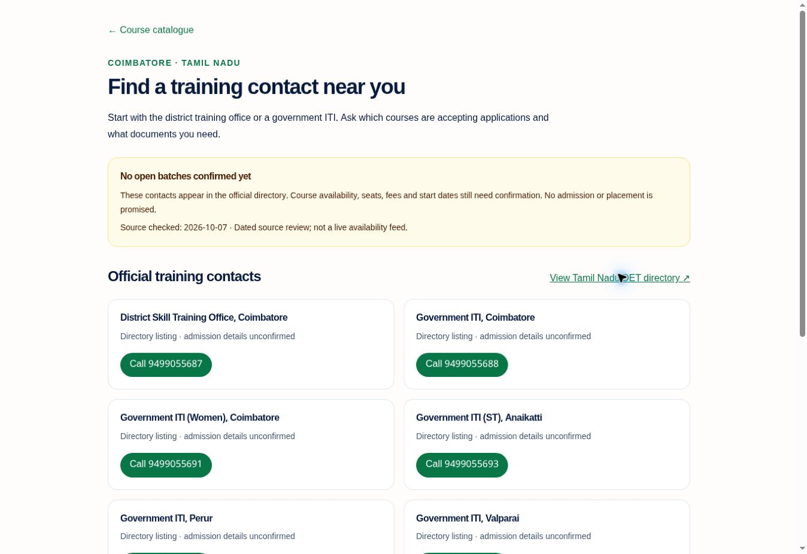

<div align="center">


<h1>LEAP AI</h1>
<p><strong>Livelihood Enablement through AI Pathways</strong></p>
<p>Your skills matter. So does your story.</p>

<p>
  <a href="https://leap-ai-khaki.vercel.app/"><strong>Open the app ↗</strong></a>
  &nbsp; · &nbsp;
  <a href="https://leap-ai-khaki.vercel.app/demo"><strong>Explore five roles</strong></a>
  &nbsp; · &nbsp;
  <a href="https://leap-ai-khaki.vercel.app/qualifications"><strong>Browse courses</strong></a>
</p>

<p>PM-AJAY · Problem Statement 26097 · Explainable livelihood guidance</p>

<a href="https://leap-ai-khaki.vercel.app/">
  
</a>

<sub>Production interface. The landing illustration depicts fictional people.</sub>

</div>

<p align="center">
  <a href="#the-solution">Solution</a> ·
  <a href="#inside-leap">Screenshots</a> ·
  <a href="#data-and-evidence">Data &amp; evidence</a> ·
  <a href="#run-locally">Quick start</a> ·
  <a href="#documentation">Documentation</a>
</p>

## The solution

A course can match someone's skills and still be impractical for their life. Travel, caregiving, available time, education and the person's own aspirations all matter.

**LEAP starts with the person, then explains the pathway.** It captures informal experience and practical constraints, asks the beneficiary to confirm their story, and compares livelihood options using inspectable rules. Evidence, missing information and human-review needs stay visible throughout.

| Understand | Explain | Support |
| :--- | :--- | :--- |
| Skills, experience, aspirations and constraints | Eligibility, fit, potential RPL and confidence reasons | Assisted assessments, human review and outcome follow-up |

### From a conversation to a next step

1. **Speak or type** — complete a structured interview in the chosen interface language.
2. **Review your story** — correct extracted answers and confirm the current preview. Original transcripts are retained.
3. **Explore pathways** — deterministic engines consider aspirations, skills, eligibility and practical constraints.
4. **See the reasons** — inspect evidence, uncertainty, potential Recognition of Prior Learning and suggested interventions.
5. **Choose with support** — beneficiaries retain the choice; support staff review uncertain cases and record follow-up.

**An LLM does not rank pathways, certify skills or verify evidence.** Optional, consent-based AI assistance can clarify an interview answer; it is disabled by default and its suggestions still require confirmation. [How AI assistance works →](docs/AI_INTERVIEW_SETUP.md)

## Try LEAP

| Experience | Link | Access |
| :--- | :--- | :--- |
| Full application | [leap-ai-khaki.vercel.app](https://leap-ai-khaki.vercel.app/) | Start here |
| Five role tours | [Explore the demo](https://leap-ai-khaki.vercel.app/demo) | No credentials required |
| Real assessments | [Sign in or register](https://leap-ai-khaki.vercel.app/auth) | Beneficiary account required |
| Course discovery | [Search the catalogue](https://leap-ai-khaki.vercel.app/qualifications) | Public |
| Coimbatore pilot | [Find training contacts](https://leap-ai-khaki.vercel.app/pilot/coimbatore) | Public; open batches unconfirmed |

> **Demo records are fictional and read-only.** Public tours grant no backend permissions and never modify live data. Saving assessments, submitting interviews and recording reviews require an authorized real account.

## Inside LEAP

Actual application captures. Role workspaces below use synthetic demo records. Select any image to view it at full size.

<table>
  <tr>
    <td width="50%" align="center" valign="top">
      <strong>01 · Choose your language</strong><br><sub>Ten choices, with translation coverage disclosed</sub><br><br>
      <a href="docs/visual-checks/production-ten-languages.jpg"></a>
    </td>
    <td width="50%" align="center" valign="top">
      <strong>02 · Explore your workspace</strong><br><sub>Credential-free tours for five roles</sub><br><br>
      <a href="docs/visual-checks/production-roles.jpg"></a>
    </td>
  </tr>
  <tr>
    <td width="50%" align="center" valign="top">
      <strong>03 · Understand the recommendation</strong><br><sub>Pathway evidence and pending human review</sub><br><br>
      <a href="docs/visual-checks/demo-pathway.jpg"></a>
    </td>
    <td width="50%" align="center" valign="top">
      <strong>04 · Support an assessment</strong><br><sub>Field worker worklists and follow-up</sub><br><br>
      <a href="docs/visual-checks/demo-field-worker.jpg"></a>
    </td>
  </tr>
  <tr>
    <td width="50%" align="center" valign="top">
      <strong>05 · Review uncertain cases</strong><br><sub>Facilitator decisions supported by evidence</sub><br><br>
      <a href="docs/visual-checks/demo-review.jpg"></a>
    </td>
    <td width="50%" align="center" valign="top">
      <strong>06 · Inspect catalogue quality</strong><br><sub>Read-only administrator diagnostics</sub><br><br>
      <a href="docs/visual-checks/demo-admin.jpg"></a>
    </td>
  </tr>
</table>

<details>
<summary><strong>View the complete beneficiary profile and district dashboard</strong></summary>

### Beneficiary profile

Confirmed answers and synthetic profile details in the demo workspace.

<p align="center"><a href="docs/visual-checks/demo-profile.jpg"></a></p>

### District officer dashboard

Aggregate recorded activity, with scope and verification limitations. These are demo counts, not measured programme outcomes.

<p align="center"><a href="docs/visual-checks/demo-officer.jpg"></a></p>

</details>

## Built for five roles

| Role | What they can do | Workspace |
| :--- | :--- | :--- |
| **Beneficiary** | Confirm their story, inspect pathways and record follow-up | `/profile`, `/pathways`, `/progress` |
| **Field worker** | Assist assessments and support follow-up | `/field-worker` |
| **Facilitator** | Inspect evidence and record review decisions | `/review` |
| **District officer** | Review aggregate recorded activity | `/officer` |
| **Administrator** | Inspect catalogue and review diagnostics | `/admin` |

Public registration creates beneficiary accounts only. Staff roles require authorized provisioning; opening a public role tour does not grant staff access.

## Languages and accessibility

**English · தமிழ் · हिन्दी · తెలుగు · ಕನ್ನಡ · മലയാളം · मराठी · বাংলা · ગુજરાતી · ଓଡ଼ିଆ**

English, Tamil and Hindi interfaces are available. Telugu, Kannada, Malayalam, Marathi, Bengali, Gujarati and Odia are **language previews**, each with 129 translated messages covering key controls, consent and all ten interview questions and hints. Some longer guidance and staff copy remain English; native-speaker review is outstanding.

- **Speak or type:** browser recognition uses the selected language tag; availability depends on the browser, provider and device.
- **Listen when available:** questions can be read aloud when a matching device voice exists. Missing voices are disclosed.
- **Keep the original answer:** Unicode text is preserved. Unrecognized work descriptions require confirmation, not invented skill matches.
- **Accessible foundations:** responsive layouts, keyboard focus, labels and reduced-motion support. Screen-reader and field usability validation remain outstanding.

[Language coverage and demo isolation →](docs/LANGUAGES_AND_DEMOS.md)

## Data and evidence

| Layer | Current coverage | What it establishes |
| :--- | :--- | :--- |
| **Discovery archive** | 1,283 NQR records + 2,366 PM-AJAY course entries | Searchable reference material; awaiting official recheck |
| **Reviewed recommendations** | 3 NQR qualifications | Source-reviewed alternative entry rules used in ranking |
| **Coimbatore pilot** | Five government ITI contacts and the district training office | Dated directory evidence; no confirmed open batches |
| **Scenario evaluation** | 17/17 authored scenarios pass | Software behaviour on fixtures; not real-speaker effectiveness |

The two discovery catalogues can overlap: **3,649 entries does not mean 3,649 unique qualifications or available batches.** Their facts were extracted from attributed Saksham archives pinned to a commit and hashes. Government sites could not be refreshed during import. LEAP did not import Saksham's application code, ranking logic or keyword annotations. Those archive entries remain outside eligibility and ranking. [Provenance and limits →](docs/CATALOGUE_DISCOVERY.md)

### Reviewed entry routes

Solar PV Installer–Electrical, Electric Vehicle Service Technician and Helper Electrician were source-reviewed on **7 October 2026**. Production startup imports the reviewed snapshot. Qualifications are checked for expiry and source-review age; this is a dated catalogue, not a live government feed.

Rules use **OR between alternative routes and AND within each route**. Education, prior NSQF levels, relevant experience, certificates and applicable literacy facts remain separate. Blank means unknown; zero experience means none reported. Facts for one qualification cannot establish eligibility for another. A matching route is a pre-screen, not admission approval.

[Explore the reviewed references →](https://leap-ai-khaki.vercel.app/qualifications#reviewed-references) · [Import documentation →](docs/NQR_REFERENCE_CATALOGUE.md)

### Coimbatore pilot

The pilot page links official contacts and supporting sources. It labels the August admission notice as closed and distinguishes training history from open enrolment.

<p align="center"><a href="https://leap-ai-khaki.vercel.app/pilot/coimbatore"></a></p>

**Real speakers tested: 0. Verified open batches: 0.** A recording scorer, collection protocol and provider-verification worksheet are ready for fieldwork. The 17 scenarios compare against the previous two-record catalogue using the same engine; they are not a Saksham head-to-head trial.

[Evaluation method](docs/PILOT_EVALUATION.md) · [Per-case results](docs/evaluation-results.json) · [Batch verification worksheet](docs/pilot-batch-verification.csv)

## Current boundaries

| Implemented | Still requires work or external confirmation |
| :--- | :--- |
| Interview confirmation, provenance and human-review gating | Independently verified beneficiary evidence |
| Deterministic eligibility, constraint and pathway engines | Broader reviewed qualification and competency coverage |
| Potential RPL routes and competency comparisons | Official assessment and certification |
| Saved-interview recovery and duplicate-submission protection | Complete offline/PWA synchronization |
| Recorded outcomes and aggregate workspaces | Independently verified placement or income outcomes |
| Server-side roles | Explicit worker assignment and comprehensive district scoping |
| Browser-supported speech | Real-speaker validation; WhatsApp and IVR adapters |

LEAP is a decision-support prototype. It does not yet satisfy every problem-statement requirement or constitute a field-validated production service. [PS 26097 acceptance checklist →](docs/PS_26097_REQUIREMENTS.md)

## Technology

| Frontend | Backend | Data and security |
| :--- | :--- | :--- |
| Next.js 16 · React 19 · TypeScript | FastAPI · Python · Pydantic | PostgreSQL production database |
| Tailwind CSS · Lucide | SQLAlchemy · Alembic | JWT · Argon2 · server-side role checks |
| Browser speech and text input | Deterministic decision engines | SQLite for local tests and synthetic fixtures |

## Run locally

**Prerequisites:** Node.js ≥22.13, pnpm 11+, Python 3.12+.

### 1. Start the backend

From the repository root:

```bash
cd backend
python -m venv .venv
source .venv/bin/activate  # Windows: .venv\Scripts\activate
pip install -r requirements.txt
cp .env.example .env      # PowerShell: Copy-Item .env.example .env
python -m alembic upgrade head
python -m seed.load_nqr_database seed/data/nqr-reference.json --apply
python -m uvicorn app.main:app --host 127.0.0.1 --port 8000
```

### 2. Start the frontend

In a second terminal at the repository root:

```bash
pnpm install
pnpm dev
```

Open **http://localhost:3000**. Public `/demo` tours work without a backend. Real workflows use `NEXT_PUBLIC_API_URL`, defaulting to `http://localhost:8000`. Interactive API documentation: **http://127.0.0.1:8000/docs**.

### 3. Verify changes

```bash
node scripts/check-localization.mjs
node scripts/check-demo.mjs
pnpm exec tsc --noEmit
pnpm build
cd backend
python -m pytest -q
python -m evaluation.run_scenarios --output ../docs/evaluation-results.json
```

[Release checks passed](https://github.com/Aarthirt14/LEAP-AI/actions/runs/37606059169): backend tests, catalogue bundle consistency, PostgreSQL import/concurrency and migration rollback/re-upgrade. Frontend checks cover language mappings and demo isolation. Software tests do not establish field effectiveness.

<details>
<summary><strong>Regenerate the synthetic demo snapshot</strong></summary>

```bash
cd backend
python -m seed.export_public_demo
```

This creates a temporary database, runs the synthetic seed and deterministic engine, and exports selected GET responses to `lib/demo-snapshot.json`. Passwords, hashes and tokens are excluded. Never replace this public fixture with real beneficiary records.

</details>

## Deployment

**Production branch: `main`.** Development previews remain separate.

| Service | Address |
| :--- | :--- |
| Application | https://leap-ai-khaki.vercel.app |
| Backend | https://leap-ai-production.onrender.com |
| Health check | https://leap-ai-production.onrender.com/health |
| Infrastructure | [`render.yaml`](render.yaml) |

The fresh production database does not contain accounts or records from the old backend. Create a new account for real workflows; staff access requires provisioning. Evaluation hosting can have cold starts and database-lifetime limits—check the active service plan before relying on it for continued operation. [Operations notes →](docs/PRODUCTION_RELEASE.md)

<details>
<summary><strong>Environment variables and request routing</strong></summary>

| Setting | Purpose |
| :--- | :--- |
| `NEXT_PUBLIC_API_URL` | Public frontend API base URL; never a secret |
| `DATABASE_URL` | Server database connection |
| `JWT_SECRET`, `SECRET_KEY` | Server-only secrets; production rejects default/short values |
| `FRONTEND_URL` | Explicit allowed frontend origins |
| `DEMO_MODE` | Keep `false` on live services; public tours do not need it |
| `AI_INTERVIEW_ENABLED`, `OPENAI_API_KEY`, `OPENAI_INTERVIEW_MODEL` | Optional server-only answer assistance |

Vercel proxies API requests through `/leap-api` to the environment's configured backend. API responses use `no-store`; authentication and authorization remain server-side. Preview uses its separate staging backend. No staging records are copied into production.

</details>

## Documentation

| Product and evidence | Engineering and operations |
| :--- | :--- |
| [PS 26097 acceptance checklist](docs/PS_26097_REQUIREMENTS.md) | [Production operations](docs/PRODUCTION_RELEASE.md) |
| [Pilot and evaluation protocol](docs/PILOT_EVALUATION.md) | [Qualification release details](docs/ELIGIBILITY_RELEASE.md) |
| [Catalogue provenance](docs/CATALOGUE_DISCOVERY.md) | [Voice, recovery and import validation](docs/VOICE_DATA_IMPROVEMENT.md) |
| [Language previews and demos](docs/LANGUAGES_AND_DEMOS.md) | [AI interview setup](docs/AI_INTERVIEW_SETUP.md) |
| [Credibility safeguards](docs/MILESTONE_1_5.md) | [UI milestone and visual checks](docs/UI_V2_MILESTONE_REPORT.md) |

---

<p align="center"><strong>Understand the person. Explain the pathway. Keep the choice human.</strong><br><sub>No license is currently declared in this repository.</sub></p>
