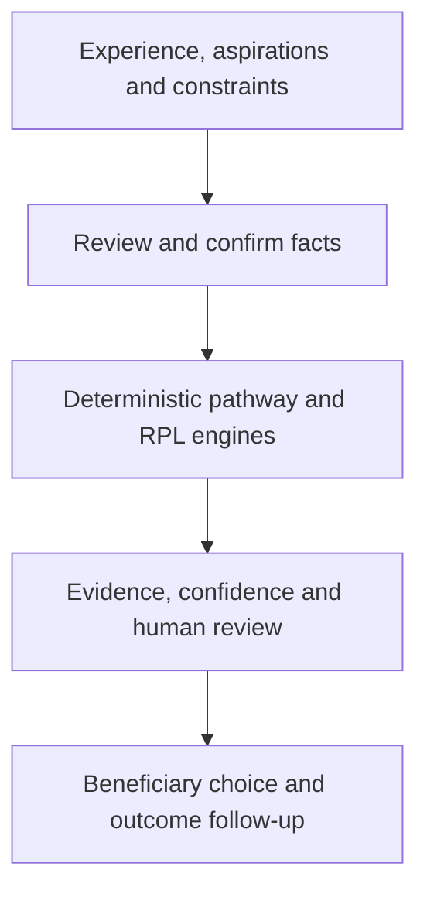
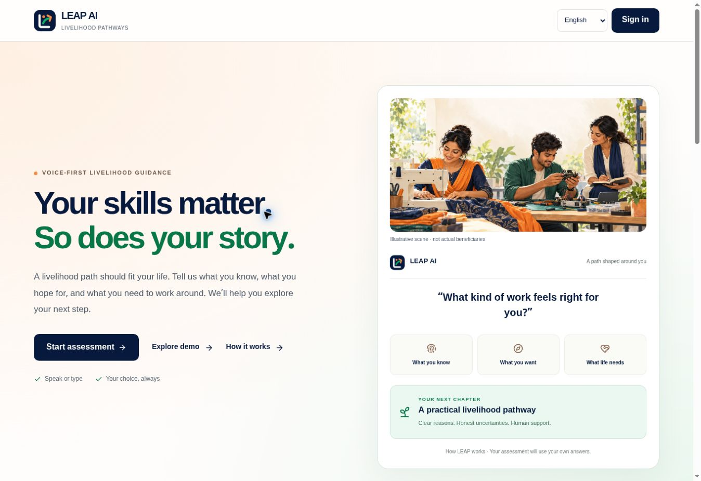
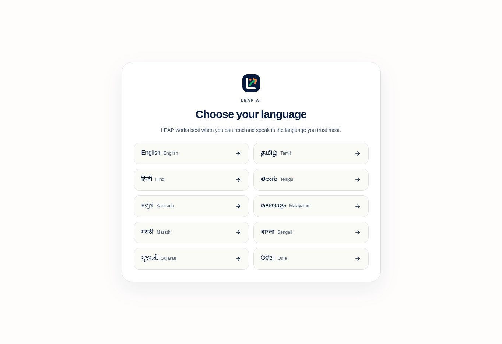
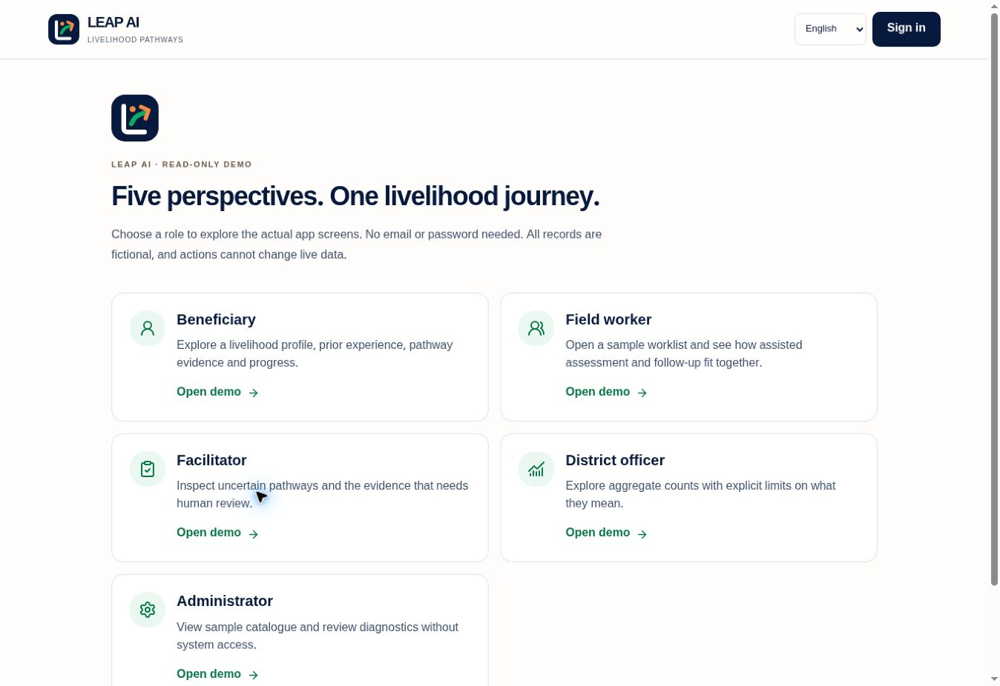
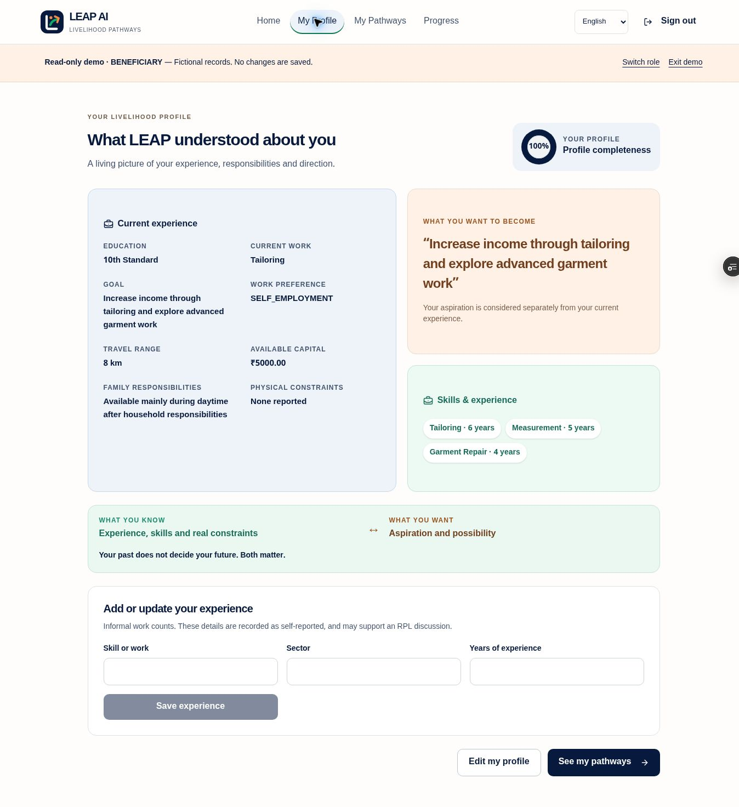
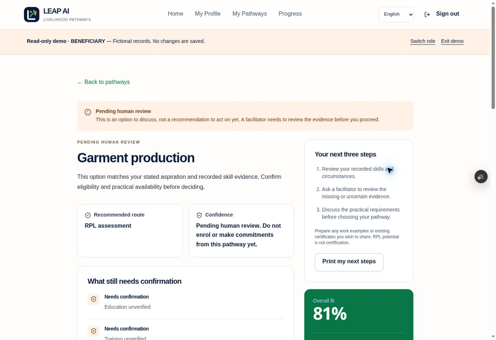
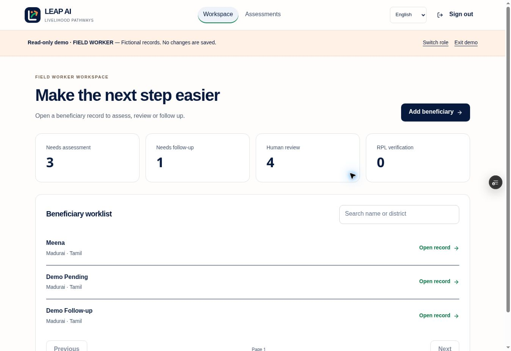
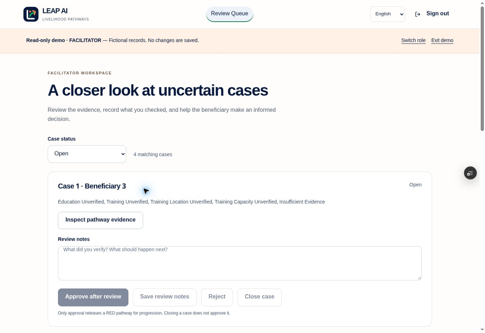
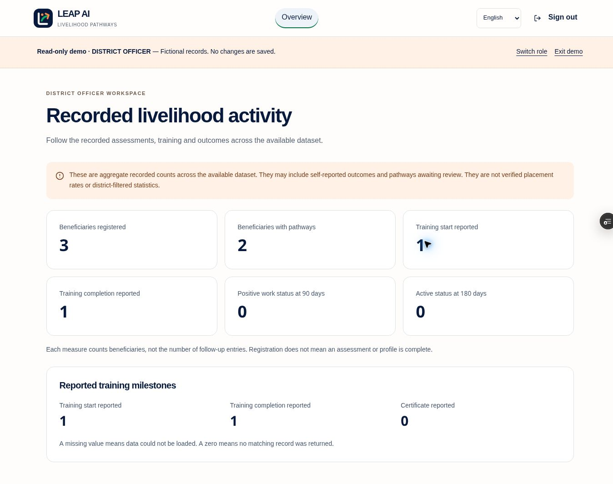
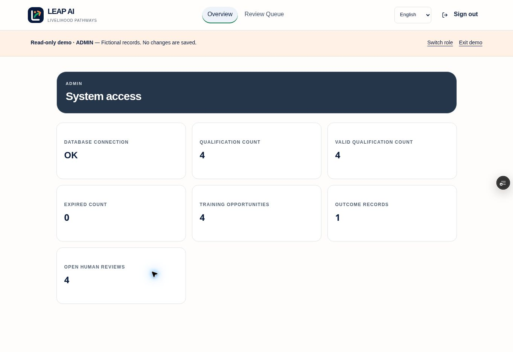

<p align="center"></p>

# LEAP AI
### Livelihood Enablement through AI Pathways

**Understand the person’s full situation before suggesting a livelihood pathway.**

LEAP AI is a decision-support prototype for **PM-AJAY, PS 26097**. It connects informal work experience, skills, aspirations, education, mobility, family responsibilities and practical constraints to explainable livelihood options. A person’s current occupation does not define their future.

LEAP goes beyond matching a voice answer to a course: it shows the evidence behind each pathway, possible Recognition of Prior Learning (RPL), missing competencies, confidence reasons and where a human must review the case. The beneficiary and their human support team retain the final decision.

## Open the application

| Link | What to expect |
| --- | --- |
| [Open LEAP AI](https://leap-ai-khaki.vercel.app/) | Main application: language selection, assessment and role workspaces. |
| [Try all five roles](https://leap-ai-khaki.vercel.app/demo) | Public, credential-free tours on the same application domain. |
| [Sign in or register](https://leap-ai-khaki.vercel.app/auth) | Real accounts use the fresh PostgreSQL-backed API. |

**Demo access:** open the role-demo link and choose Beneficiary, Field worker, Facilitator, District officer or Administrator. No LEAP email/password is needed. All demo records are fictional, marked read-only, and stored in a frontend snapshot. Public demo sessions confer no backend permissions. Saving, interview submission, approval and outcome reporting require a real account; these actions never mutate live data in a demo.

## Official qualification reference catalogue

The `/qualifications` page contains two real NQR references reviewed on 7 October 2026: Solar PV Installer–Electrical and Electric Vehicle Service Technician. Each preserves alternative entry routes, duration, NSQF level, source link and published validity. It marks expired or overdue-for-review records. This is a manually maintained reference snapshot, not a live government feed or a list of available batches. These references are not yet used by the recommendation engine: its single education/experience fields cannot faithfully represent all official alternatives.

See [source and import notes](docs/NQR_REFERENCE_CATALOGUE.md).

## The problem LEAP addresses

A useful livelihood suggestion needs more than a qualification and a list of courses. Someone may have years of informal tailoring experience, want to grow a home enterprise, have limited travel options and need to work around caregiving. Ignoring any one of those details can make a technically eligible option impractical.

LEAP asks about the person’s situation first, separates confirmed answers from verified evidence, and identifies the uncertainties that still need a field worker, facilitator or training provider.

## How the solution works

1. **Listen and capture:** a structured interview accepts text and browser-supported speech. Informal experience, aspirations, family work, work preference, mobility, investment and constraints are recorded.
2. **Review and confirm:** extracted facts remain drafts until the beneficiary reviews or corrects them and confirms the current preview. Original transcripts are preserved. Confirmation does not make a fact independently verified.
3. **Compare practical pathways:** deterministic engines apply qualification validity, eligibility, aspiration, skills, constraints and available evidence. Synthetic availability does not receive verified opportunity credit.
4. **Explain uncertainty:** pathway details show score components, evidence provenance, potential RPL and interventions. RED-confidence options remain pending human review; closing a case alone does not approve it.
5. **Support the next step:** field workers assist assessments and follow-ups; facilitators review uncertain cases; officers view aggregate recorded activity. Reported outcomes are not advertised as verified placements.



## Screenshots

These are captures of the running redesign, not mockups. Role screenshots show **synthetic read-only data**. The landing artwork depicts fictional people, not actual beneficiaries.

### Landing page and original LEAP identity



### Choose from ten languages

English, Tamil, Hindi, Telugu, Kannada, Malayalam, Marathi, Bengali, Gujarati and Odia. See [Languages and accessibility](#languages-and-accessibility) for translation coverage.



### Explore all five roles



### Beneficiary profile and pathway evidence





### Field support and human review





### Aggregate recorded activity



## Role workspaces

| Role | Screens | Purpose |
| --- | --- | --- |
| Beneficiary | `/`, `/onboarding`, `/interview`, `/profile`, `/pathways`, `/pathway`, `/progress` | Confirm their story, inspect options and record follow-up. |
| Field worker | `/field-worker` | Assisted assessments, profiles, pathways and follow-up. |
| Facilitator | `/review` | Inspect evidence and record review decisions. |
| District officer | `/officer` | Aggregate recorded counts with explicit scope/verification limitations. |
| Administrator | `/admin` | Catalogue and review diagnostics. |

Public registration creates beneficiary accounts only. Real staff roles require authorized provisioning. The public administrator demo is only a sample screen, not administrative access.

### Sample administrator diagnostics



## Languages and accessibility

- English, Tamil and Hindi interfaces; **seven additional language previews:** Telugu, Kannada, Malayalam, Marathi, Bengali, Gujarati and Odia.
- Each new language has 129 translated messages covering key controls, consent, and all ten interview questions and hints. Longer guidance and some staff copy remain English; this is disclosed in the app. Native-speaker review is outstanding.
- Browser speech recognition receives the chosen language tag. Actual availability depends on the browser/provider and device. Dialect coverage has not been validated; typing remains available.
- Interview questions and hints can be read aloud on request when the device has a matching language voice; missing voices are disclosed. Speech quality still requires device and speaker testing.
- Raw Unicode answers are preserved. Unknown work descriptions require confirmation/human review, rather than invented skill matches. Language selection never sets geographic state.
- Responsive layouts, keyboard focus, accessible labels and reduced-motion support. Actual screen-reader and field usability validation remain outstanding.

See [language and demo implementation notes](docs/LANGUAGES_AND_DEMOS.md).

## AI assistance and the decision boundary

The optional OpenAI integration clarifies one answer only after explicit consent. It is disabled by default, uses `store: false`, keeps the original answer, and returns a suggestion that still needs review and confirmation. Timeouts or provider errors preserve the manual workflow.

**An LLM does not rank pathways, certify skills, verify evidence or decide someone’s livelihood.** Ranking remains deterministic and inspectable. Optional AI provider access and multilingual semantic accuracy need separate live validation. See [AI setup and limitations](docs/AI_INTERVIEW_SETUP.md).

## What is implemented—and what is not

| Area | Current status |
| --- | --- |
| Interview confirmation, provenance, date-based qualification validity, RED review gating | Implemented with backend regression tests. |
| RPL | Competency comparison and potential routes; **not official certification**. |
| Local opportunities and training | Provenance-aware records; **no verified live district-wide availability feed**. Synthetic centres, seats and distances need confirmation. |
| Official NQR / NSQF / QP / NOS grounding | Import/normalization foundations; current authoritative catalogue validation is still needed. No claim of a live official integration. |
| Outcomes | Recorded follow-ups and aggregates; not independently verified placement rates. |
| Low connectivity | Saved interviews resume after refresh; repeated identical answer submissions reuse the saved record. Unsent answers remain current-page only; **no complete offline/PWA sync**. |
| WhatsApp / IVR | Future integration work, not working adapters. |
| Staff authorization | Existing role controls. Explicit worker assignment policy and comprehensive district scoping remain separate backend tasks. |

The [PS acceptance checklist](docs/PS_26097_REQUIREMENTS.md) records requirement gaps. This prototype does **not** yet satisfy every PS requirement or constitute a field-validated production service.

## Technology

- **Frontend:** Next.js 16, React 19, TypeScript, Tailwind CSS, Lucide.
- **Backend:** Python, FastAPI, SQLAlchemy, Pydantic, Alembic.
- **Data:** SQLite for local/demo use; PostgreSQL driver support. Database choice alone does not provide persistence or operational readiness.
- **Authentication:** JWT access/refresh tokens, Argon2 password hashing and server-side role checks.
- **Engines:** constraints, qualification validity, aspiration matching, RPL, deterministic ranking, confidence and outcome evidence.

## Run locally

Prerequisites: Node.js >=22.13, pnpm 11+, Python 3.12+.

Backend, from the repository root:

```bash
cd backend
python -m venv .venv
source .venv/bin/activate  # Windows: .venv\Scripts\activate
pip install -r requirements.txt
cp .env.example .env      # PowerShell: Copy-Item .env.example .env
python -m alembic upgrade head
python -m uvicorn app.main:app --host 127.0.0.1 --port 8000
```

Frontend, in a second terminal at the repository root:

```bash
pnpm install
pnpm dev
```

Open `http://localhost:3000`. `/demo` works without the backend. Real workflows use `NEXT_PUBLIC_API_URL`, defaulting to `http://localhost:8000`. API documentation is at `http://127.0.0.1:8000/docs`.

## Verify changes

```bash
node scripts/check-localization.mjs
node scripts/check-demo.mjs
pnpm exec tsc --noEmit
pnpm build
cd backend
python -m pytest -q
```

Latest backend run: **101 passed**, with one dependency deprecation warning. Frontend checks include ten-language mappings and demo isolation: no live API calls during a demo, even for mutations or missing sample records. Tests are not a guarantee of field effectiveness or complete browser E2E coverage.

Regenerate the public synthetic snapshot locally:

```bash
cd backend
python -m seed.export_public_demo
```

This command creates a temporary database, runs the existing synthetic seed and deterministic engine, and exports selected GET responses to `lib/demo-snapshot.json`. It never exports passwords, password hashes or tokens. Do not replace this fixture with real beneficiary records.

## Deployment and configuration

The public application is consolidated at **https://leap-ai-khaki.vercel.app**. Production code lives on `main`; branch previews are for development only.

- Frontend: `https://leap-ai-khaki.vercel.app`
- Fresh backend: `https://leap-ai-production.onrender.com`
- Health: `https://leap-ai-production.onrender.com/health`
- Infrastructure: [`render.yaml`](render.yaml), with generated server secrets and a private-network PostgreSQL connection.

**Fresh database:** accounts and records from the old backend have not been migrated. Create a new account for real workflows. Staff roles require authorized provisioning; qualification and opportunity catalogues require validated imports. The five role tours remain immediately usable with isolated synthetic data.

**No-cost hosting limits:** the Render API sleeps when idle, so the first request can be slow. The free PostgreSQL database expires after 30 days; upgrade or migrate before expiry. This deployment is suitable for evaluation, not unattended long-term operation.

| Setting | Purpose |
| --- | --- |
| `NEXT_PUBLIC_API_URL` | Frontend API base URL; public configuration, never a secret. |
| `DATABASE_URL` | Backend database connection. |
| `JWT_SECRET`, `SECRET_KEY` | Server-only, non-default secrets. Production startup rejects defaults/short values. |
| `FRONTEND_URL` | Explicit allowed frontend origins. |
| `DEMO_MODE` | Keep **false** on live services. Public read-only tours do not need it. |
| `AI_INTERVIEW_ENABLED`, `OPENAI_API_KEY`, `OPENAI_INTERVIEW_MODEL` | Optional server-only answer assistance; see setup document. Never put the API key in client variables. |

Vercel proxies API requests through `/leap-api` on the app domain to the environment’s configured backend. API responses are marked `no-store`; authentication and role checks remain server-side. Preview retains its separate staging backend. No staging records are copied into production.

## Documentation

- [Voice, recovery and import validation milestone](docs/VOICE_DATA_IMPROVEMENT.md)
- [Production release and operations](docs/PRODUCTION_RELEASE.md)
- [Milestone report and visual checks](docs/UI_V2_MILESTONE_REPORT.md)
- [Credibility safeguards](docs/MILESTONE_1_5.md)
- [Problem-statement acceptance checklist](docs/PS_26097_REQUIREMENTS.md)
- [AI interview setup](docs/AI_INTERVIEW_SETUP.md)
- [Language previews and public demos](docs/LANGUAGES_AND_DEMOS.md)

No license is currently declared in this repository.
